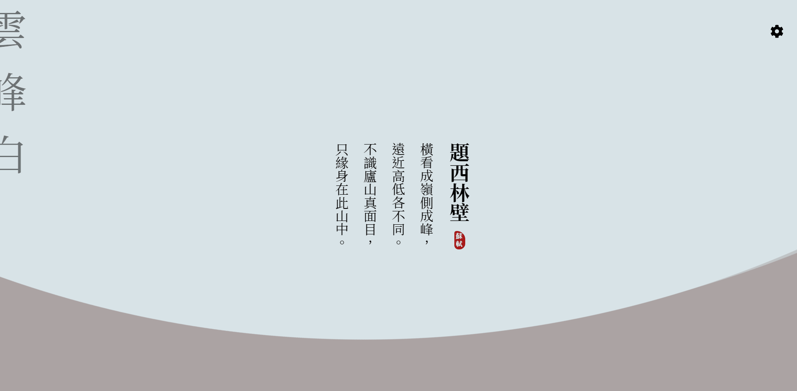
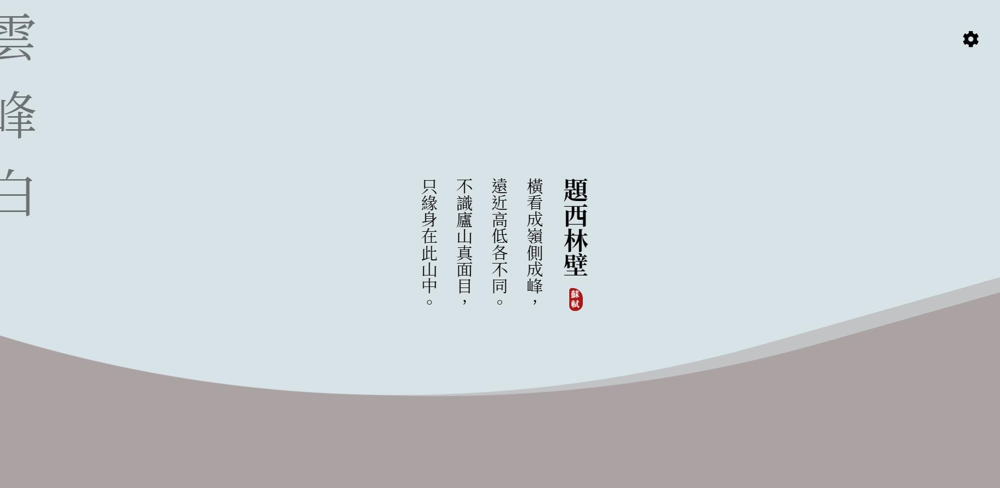
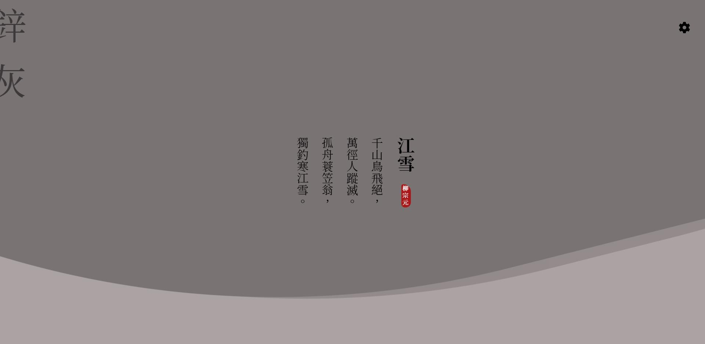
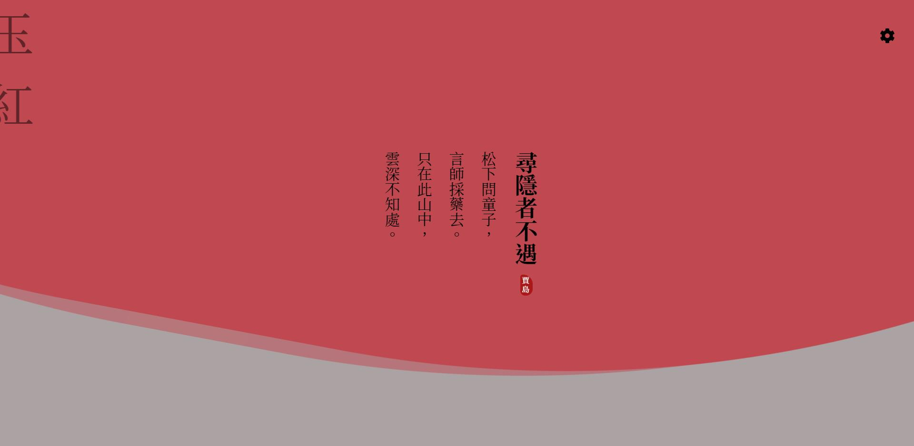
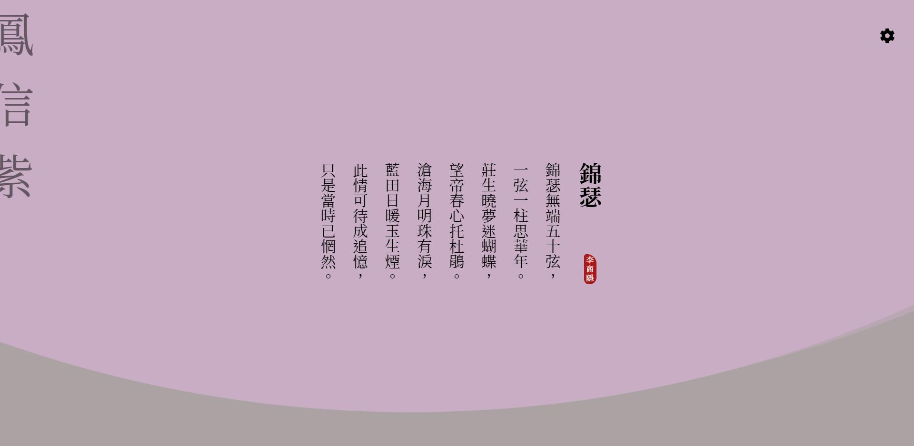
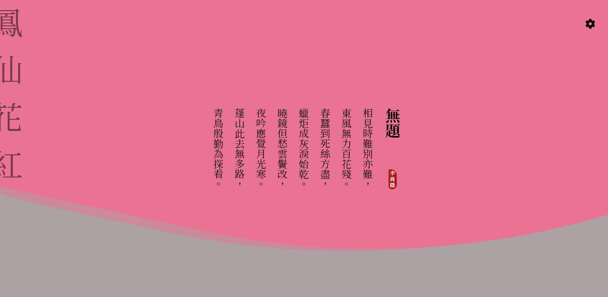

# 詩乎

一個分頁讀一首詩

## 庸庸碌碌的每一天，靜下來讀一首詩

你有多久沒有讀詩了?每一天庸庸碌碌，打開瀏覽器不是要打開信箱看專案的進度報告不然就是要開始做給客戶看的簡報，每天忙得不可開交，是否好久沒有靜下心來泡一壺茶，細細品嘗一首詩呢?

## 預覽
### 題西林壁 + 雲峰白

### 江雪 + 鋅灰

### 尋隱者不遇 + 玉紅

### 錦瑟 + 鳳信紫

### 無題 + 鳳仙花紅

## 使用技術

### 網站建構

- Angular

### 動畫效果

- animate.css
- css animation

### 字體

- google fonts
